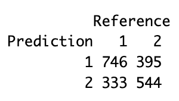
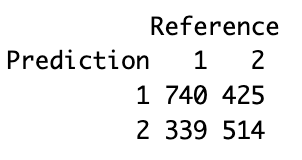
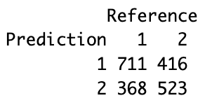
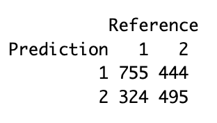
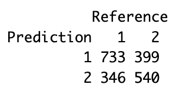

# **Predicting Flu Vaccine Receival Among New York City Residents in 2020 Using Machine Learning**

*Keerti Koya*

## **Abstract**

#### Problem

Between October 1, 2019 and May 15, 2021, New York State reported 162,679 positive flu cases. This study aims to answer how age, poverty level, and healthcare access affected whether a New York City (NYC) resident received the flu vaccine in 2020.

#### Approach

After data cleaning and preparation, the final dataset contained 8071 observations of 17 variables. The variables used were "agegroup6," "imputed_povertygroup," "generalhealth," "insuredgateway20," "insured," "insure5," "pcp20," "medplace," "didntgetcare20," "regularrx," "toldhighbp20," "mhtreat20_all," "smokecat," "employment20," "difficultdailyact," "assistdevice," and "fluvaccineshot." Chi-squared tests were run on every variable with "fluvaccineshot," which served as the response variable. Five machine learning models (logistic regression, gradient-boosted trees, random forest, k nearest neighbor, and support vector machine) were trained and tested on the data, and their accuracy was determined through a confusion matrix.

#### Results

After running chi-squared tests, "didntgetcare20" was the only variable with a p-value greater than 0.05, so it was deemed not significant and removed from the dataset. The accuracy for the logistic regression, gradient-boosted trees, random forest, KNN, and SVM models were 67.21%, 65.95%, 64.46%, 62.98%, and 63.08% respectively.

#### Conclusion

Age, poverty level, and healthcare access are not good indicators of whether or not an NYC resident received the flu vaccine in 2020 on their own. Broader factors must be considered for more accurate predictions. Once those factors are found, we can implement changes in public health programs to vaccinate more residents and decrease the number of annual flu cases in NYC.

## **Introduction**

As defined by the Centers for Disease Control and Prevention (CDC), the flu is "a contagious respiratory illness caused by influenza viruses that infect the nose, throat, and sometimes the lungs" ("Key Facts"). Between October 1, 2019 and May 15, 2021, New York State reported 162,679 positive flu cases (Rizzo). Flu cases reported on Staten Island this year broke records since New York State began tracking flu data publicly in 2009 (Knudson). The CDC stated that the **"**best way to prevent flu is by getting a flu vaccine" ("Seasonal Influenza (Flu) Vaccination"). This study aims to answer how age, poverty level, and healthcare access affected whether an NYC resident received the flu vaccine in 2020.

## **Methods**

### Data cleaning

The initial dataframe created from the dataset contained 8,781 observations of 143 variables. Many columns had several NA values, so all NA values were set to the average of the values in the column. The variable "toohighblsugar" was in date-time format, and had to be converted into numeric format before NA values were replaced with the column average.

{width="900"}

![Figure 1b. Based off Figure 1a, the variables of interest were chosen to be "agegroup6," "imputed_povertygroup," "generalhealth," "insuredgateway20," "insured," "insure5," "pcp20," "medplace," "didntgetcare20," "regularrx," "toldhighbp20," "mhtreat20_all," "smokecat," "employment20," "difficultdailyact," "assistdevice," and "fluvaccineshot," and a new dataframe with these variables was created. More information on each variable can be found in the 2020 NYC Community Health Survey Analytic Codebook.](images/Final Var Corr Plot.png){width="700"}

 

|                      |                                                                                                  |
|----------------------|--------------------------------------------------------------------------------------------------|
| **Variable Name**    | **Measures**                                                                                     |
| agegroup6            | Age                                                                                              |
| imputed_povertygroup | Poverty level calculated by household annual income                                              |
| generalhealth        | General health condition                                                                         |
| insuredgateway20     | Existence of health insurance coverage                                                           |
| insured              | Existence of health insurance                                                                    |
| insure5              | Type of health insurance coverage                                                                |
| pcp20                | Existence of a personal doctor or health care provider                                           |
| medplace             | Location of meeting a health professional                                                        |
| didntgetcare20       | Needed medical care but did not get it                                                           |
| regularrx            | Medicine prescription or refills                                                                 |
| toldhighbp20         | Told by healthcare professional that they have hypertension                                      |
| mhtreat20_all        | Received counseling or prescription medication for a mental health concern in the last 12 months |
| smokecat             | Type of smoker                                                                                   |
| employment20         | Employment status                                                                                |
| difficultdailyact    | Difficulty in performing daily activities                                                        |
| assistdevice         | Use of any assistive devices                                                                     |
| fluvaccineshot       | Received a flu shot in the last 12 months                                                        |

Table 1. Table briefing on predictor and response variables.

"fluvaccineshot" was determined to be the response variable and all other variables were predictor variables. As can be seen in the codebook, many variables have "Don't know," "Refused," or "Missing/Not asked" values. Rows with these values were removed, and the resulting dataset contained 8,071 observations of 17 variables.

### Hypothesis testing

#### Chi-squared tests

A chi-squared test is a statistical hypothesis test used to determine whether two categorical variables are correlated. The test was conducted on each predictor variable to see its correlation to "fluvaccineshot." Those with a p-value greater than 0.05 were deemed not significant and were removed from the dataset. The final dataset contained 8,071 observations of 16 variables.

#### Machine learning

Principal component analysis (PCA) was used to reduce the dimensionality of the dataset while increasing interpretability. The final dataset was split into a training set and a testing set using a 75:25 ratio respectively. Five machine learning models, namely logistic regression, gradient-boosted trees, random forest, k nearest neighbor (KNN), and support vector machine (SVM), were trained and tested, and their accuracy was recorded using a confusion matrix.

## **Results and discussion**

{width="800"}

The p-values for the chi-squared tests conducted on "agegroup6," "imputed_povertygroup," "generalhealth," "insuredgateway20," "insured," "insure5," "pcp20," "medplace," "didntgetcare20," "regularrx," "toldhighbp20," "mhtreat20_all," "smokecat," "employment20," "difficultdailyact," and "assistdevice" with "fluvaccineshot" were 4.334091e-67, 0.0001980559, 2.912482e-08, 2.171387e-28, 1.361778e-30, 1.704919e-48, 3.54575e-79, 3.279108e-30, 0.2095622, 3.043354e-105, 9.00902e-38, 2.322162e-10, 1.987408e-13, 5.198959e-47, 4.548509e-11, and 6.070845e-17 respectively (See Figure 3). "didntgetcare20" was the only variable with a p-value greater than 0.05, and so it was deemed not significant and removed from the dataset.

{width="198"}

{width="198"}

{width="198"}

{width="198"}

{width="198"}

As seen in Figures 3a-3e, the accuracy for the logistic regression, gradient-boosted trees, random forest, KNN, and SVM models were 67.21%, 65.95%, 64.46%, 62.98%, and 63.08% respectively.

{width="800"}

## **Conclusion**

It is extremely important that as many NYC residents are vaccinated against the flu as possible and to do so, we must understand what motivates or causes a resident to be vaccinated. From this study, it can be determined that age, poverty level, and healthcare access are not good indicators of whether an NYC resident in 2020 received their vaccine on their own. Instead, broader factors must be considered for more accurate predictions. Researchers can now look for which factors more greatly contribute to flu vaccine receival, and public health practitioners can use that information to better understand which groups to target while policymakers can push for relevant changes. Researchers can also expand beyond the flu vaccine and consider other immunizations and their receival rates. 

## **Code and data availability**

The data supporting the findings of this study is available at <https://www.nyc.gov/site/doh/data/data-sets/community-health-survey.page>. Codes developed in this study can be accessed at <https://github.com/the-codingschool/DSRP-2023-Greenleaf/tree/main/Keerti>.

## **Acknowledgments**

I would like to acknowledge The Coding School for the opportunity to learn about data science and collaborate with the Columbia University Data Science Institute; Sarah Parker, Delaney Rice, and Yijia Wang for teaching me R; and Dr. Abba Greenleaf for guidance on the project and teaching me about public health and data science.

## **Sources**

"Community Health Survey." *Community Health Survey - NYC Health*, www.nyc.gov/site/doh/data/data-sets/community-health-survey.page.

"Key Facts About Influenza (Flu)." *Centers for Disease Control and Prevention*, 24 Oct. 2022, www.cdc.gov/flu/about/keyfacts.htm.

Knudson, Annalise. "Record-Breaking Flu Season in NYC: Here Are the Staggering Numbers on Staten Island, According to State Data." *Silive*, 21 Feb. 2023, www.silive.com/news/2022/12/record-breaking-flu-season-in-nyc-here-are-the-staggering-numbers-on-staten-island-according-to-state-data.html.

Rizzo, Sara. "Tracking Flu Cases throughout New York State." *NEWS10 ABC*, 23 Dec. 2022, www.news10.com/health/tracking-flu-cases-throughout-new-york-state/.

"Seasonal Influenza (Flu) Vaccination and Preventable Disease." *Centers for Disease Control and Prevention*, 22 Nov. 2016, www.cdc.gov/vaccines/vpd/flu/.
