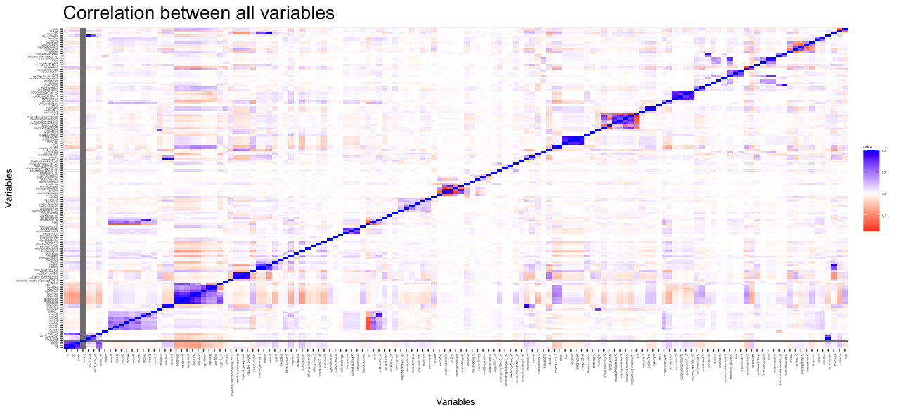

# **Predicting Flu Vaccine Receival Among New York City Residents in 2020 Using Machine Learning**

*Keerti Koya*

## Abstract

#### Problem

#### Approach

#### Results

#### Conclusion

## **Introduction ✅**

As defined by the Centers for Disease Control and Prevention, the flu is "a contagious respiratory illness caused by influenza viruses that infect the nose, throat, and sometimes the lungs." Between October 1, 2019 and May 15, 2021, New York State reported 162,679 positive flu cases. Flu cases reported on Staten Island this year broke records since New York State began tracking flu data publicly in 2009. The CDC stated that the **"**best way to prevent flu is by getting a flu vaccine." This study aims to to answer how age, poverty level, and healthcare access affected whether an NYC resident received the flu vaccine in 2020.

## **Methods ✅**

### Data cleaning ✅

The initial dataframe created off the dataset contained 8,781 observations of 143 variables. Many columns had several NA values, so all NA values were set to the average of the values in the column. The variable "toohighblsugar" was in date-time format, and had to to be converted into numeric format before NA values were replaced with the column average.

![Based off the correlation tile plot, the variables of interest were chosen to be "agegroup6," "imputed_povertygroup," "generalhealth," "insuredgateway20," "insured," "insure5," "pcp20," "medplace," "didntgetcare20," "regularrx," "toldhighbp20," "mhtreat20_all," "smokecat," "employment20," "difficultdailyact," "assistdevice," and "fluvaccineshot," and a new dataframe with these variables was created. More information on each variable can be found in the [2020 NYC Community Health Survey Analytic Codebook](https://www.nyc.gov/assets/doh/downloads/pdf/episrv/chs2020-codebook.pdf).](images/Correlation%20Plot%20Between%20Variables.png)

"fluvaccineshot" was determined to be the response variable and all other variables were explanatory variables. As can be seen in the codebook, many variables have "Don't know," "Refused," or "Missing/Not asked" values. Rows with these values were removed, and the resulting dataset contained 8,071 observations of 17 variables.

### Hypothesis testing ✅

#### Chi-squared tests ✅

A chi-squared test is a statistical hypothesis test used to determine whether two categorical variables are correlated. The test was conducted on each explanatory variable to see its correlation to "fluvaccineshot." Those with a p-value greater than 0.05 were deemed not significant and were removed from the dataset. The final dataset contained 8,071 observations of 16 variables.

#### Machine learning ✅

Principal component analysis (PCA) was used to reduce the dimensionality of the dataset while increasing interpretability. The final dataset was split into a training set and testing set using a 75:25 ratio respectively. Five machine learning models, namely logistic regression, gradient-boosted trees, random forest, k-nearest neighbor, and support vector machine, were trained and tested, and their accuracy was recorded using a confusion matrix.

## **Results and discussion**

The p-values for the chi-squared tests conducted on "agegroup6," "imputed_povertygroup," "generalhealth," "insuredgateway20," "insured," "insure5," "pcp20," "medplace," "didntgetcare20," "regularrx," "toldhighbp20," "mhtreat20_all," "smokecat," "employment20," "difficultdailyact," and "assistdevice" with "fluvaccineshot" were

## **Conclusion**

From this study, it can be determined that age, poverty level, and healthcare access are not good indicators of whether an NYC resident in 2020 received their vaccine on their own. Instead, broader factors must be considered for more accurate predictions. Researchers can now look for which factors more greatly contribute to flu vaccine receival, and public health practitioners can use that information to better understand which groups to target while policymakers can push for relevant changes. Researchers can also expand beyond the flu vaccine and consider other immunizations and their receival rates. 

It is extremely important that as many NYC residents are vaccinated against the flu as possible and in order to do so, we must understand what motivates or causes a resident to be vaccinated. While this study showed that age, poverty level, and healthcare access do play a role, there are still other factors that must be taken into consideration. Once those factors are observed, we can implement changes in public health programs to vaccinate more people and decrease the number of annual flu cases in NYC.

## **Code and data availability ✅**

The data supporting the findings of this study is available at <https://www.nyc.gov/site/doh/data/data-sets/community-health-survey.page>. Codes developed in this study can be accessed at <https://github.com/the-codingschool/DSRP-2023-Greenleaf/tree/main/Keerti>.

## **Acknowledgements ✅**

I would like to acknowledge The Coding School for the opportunity to learn about data science and collaborate with Columbia University Data Science Institute; Sarah Parker, Delaney Rice, and Yijia Wang for teaching me R; and Dr. Abba Greenleaf for the guidance on the project and teaching me about public health and data science.

## Sources

<https://www.nyc.gov/site/doh/data/data-sets/community-health-survey.page> the data lol

[https://www.cdc.gov/flu/about/keyfacts.htm#:\~:text=Treating%20Flu-,What%20is%20Influenza%20(Flu)%3F,a%20flu%20vaccine%20each%20year.](https://www.cdc.gov/flu/about/keyfacts.htm#:~:text=Treating%20Flu-,What%20is%20Influenza%20(Flu)%3F,a%20flu%20vaccine%20each%20year.) cdc flu stat

<https://www.cdc.gov/vaccines/vpd/flu/index.html#:~:text=flu%2Drelated%20hospitalizations.-,CDC%20recommends%20that%20everyone%206%20months%20of%20age%20and,a%20flu%20vaccine%20every%20year.> the other cdc stat
